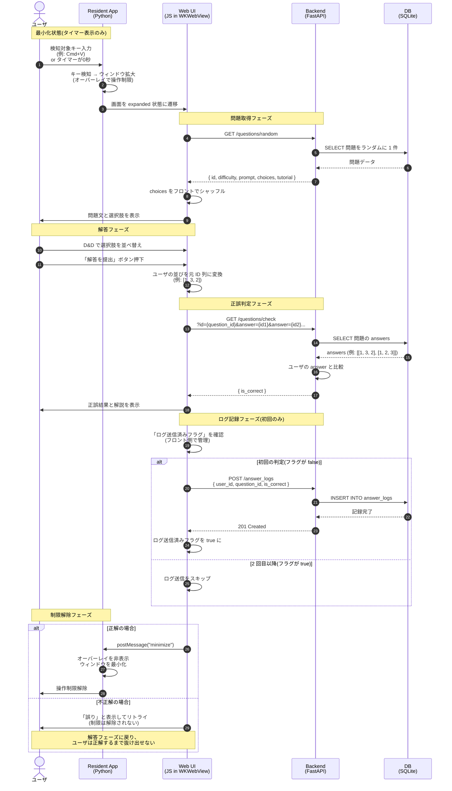

# Linux Virus データフロー

## 概要
本ドキュメントは、Linux Virus アプリケーションにおけるユーザの一連の解答フローと、コンポーネント間のやり取りをまとめたものです。

---

## 1. システム構成

| コンポーネント | 役割 |
|---|---|
| Resident App (Python) | macOS 常駐アプリ。キー検知・ウィンドウ管理・WKWebView の起動を担当 |
| Web UI (HTML/CSS/JS) | WKWebView 内で動作する画面。問題表示・D&D・解答提出を担当 |
| Backend (FastAPI) | API サーバ。DB アクセス・問題取得・正誤判定・ログ記録を担当 |
| DB (SQLite) | 問題・ユーザ・解答ログを永続化 |

---

## 2. シーケンス図

ユーザがキー検知をトリガにして問題を解き、画面制限が解除されるまでの一連の流れを示す。

---

## 3. データの流れの要点

### 3.1 選択肢のシャッフルとID管理
- DB には `choices` が元順序で格納されている(元 ID は 1, 2, 3, ...)
- バックエンドは元順序のままフロントに返す
- フロントはシャッフルして表示するが、元 ID を保持しておく
- 解答提出時は元 ID 列をバックエンドに送る
- バックエンドは DB の `answers`(元 ID で記録)と直接比較できる

### 3.2 ログ記録の「初回のみ」ルール
- フロント側で「ログ送信済みフラグ」を問題ごとに管理
- 同じ問題でリトライしても 2 回目以降は POST しない
- 問題が新しく表示された時点でフラグはリセットされる

### 3.3 制限解除のトリガ
- 正解時: フロントから `minimize` メッセージを Python 側に送り、オーバーレイを非表示にして操作制限を解除
- 不正解時: 「誤り」と解説を表示するのみ。操作制限は解除されず、ユーザは正解するまで解答フェーズを繰り返す
