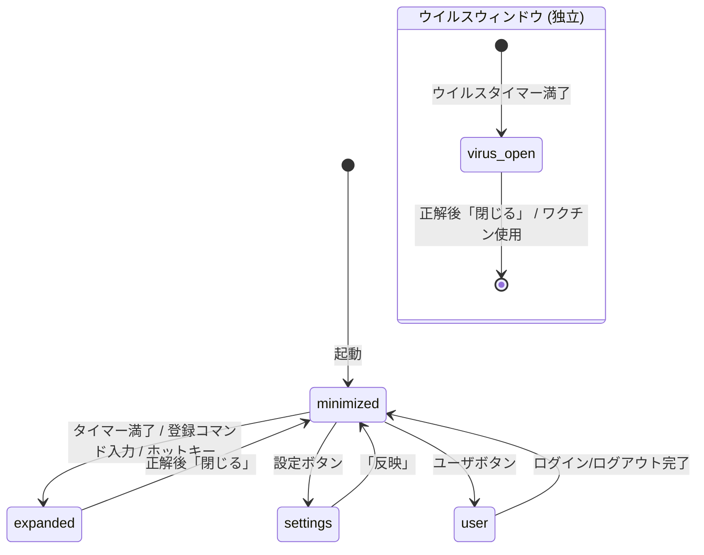
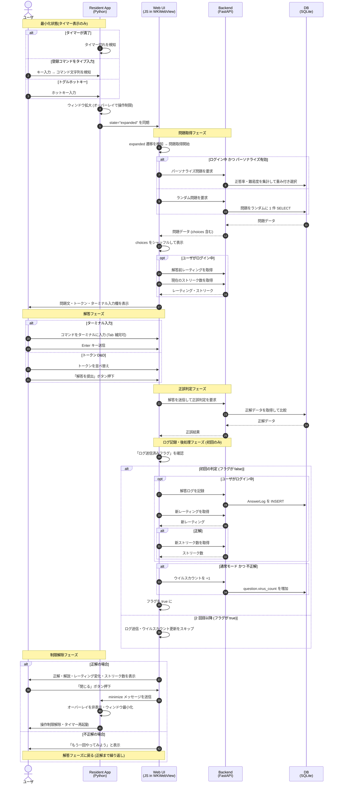
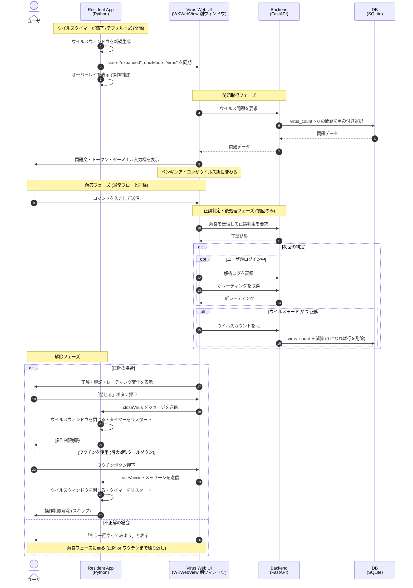

# Linux Virus データフロー

## 概要
本ドキュメントは、Linux Virus アプリケーションにおけるユーザの一連の解答フローと、コンポーネント間のやり取りをまとめたものです。

---

## 1. システム構成

| コンポーネント | 役割 |
|---|---|
| Resident App (Python) | macOS 常駐アプリ。キー検知・ウィンドウ管理・WKWebView の起動・ウイルスタイマーを担当 |
| Web UI (HTML/CSS/JS) | WKWebView 内で動作する画面。問題表示・ターミナル入力・D&D・解答提出を担当 |
| Backend (FastAPI) | API サーバ。問題取得・正誤判定・ログ記録・レーティング計算・ウイルスカウント管理を担当 |
| DB (SQLite) | 問題・ユーザ・解答ログ・ウイルスカウントを永続化 |

---

## 2. 状態遷移

`_ResidentState.view` は `minimized` / `expanded` / `settings` / `user` の 4 値を取る。
通常のウィンドウとは独立して、ウイルスウィンドウが別ウィンドウとして存在することがある。

---

## 3. 通常出題フロー

コマンド入力またはタイマー満了を契機に問題が出題され、正解後に制限が解除されるまでの流れ。

---

## 4. ウイルス出題フロー

Resident App が一定間隔でウイルス問題の有無を確認し、溜まっていれば別ウィンドウで出題する。
通常出題ウィンドウが表示中でも並行して起動する。

---

## 5. データの流れの要点

### 5.1 選択肢のシャッフルと ID 管理
- DB には `choices` が元順序で格納されている (元 ID は 1, 2, 3, ...)
- バックエンドは元順序のままフロントに返す
- フロントはシャッフルして表示するが、元 ID を保持しておく
- 解答提出時は元 ID 列をバックエンドに送る
- バックエンドは DB の `answers` (元 ID で記録) と直接比較できる

### 5.2 解答入力の二系統
- **ターミナル入力 (主)**: `#terminalInput` にコマンドを直接タイプ。Tab キーで未使用トークンを補完できる
- **トークン D&D (副)**: トークンボタンをドラッグ&ドロップまたはクリックして並べ替える
- 送信時はターミナル入力値を優先し、空の場合は D&D の selected 列を使用する

### 5.3 ログ記録の「初回のみ」ルール
- フロント側で `answerLogged` フラグを問題ごとに管理
- 同じ問題でリトライしても 2 回目以降はログ送信・ウイルスカウント更新をしない
- 新しい問題が読み込まれた時点でフラグはリセットされる

### 5.4 ウイルスカウントの増減ロジック

| 出題モード | 結果 | virus_count |
|---|---|---|
| 通常 | 不正解 (初回のみ) | +1 |
| ウイルス | 正解 (初回のみ) | -1 |
| 上記以外 | — | 変化なし |

### 5.5 レーティングとストリーク
- 問題読み込み時に解答前レーティングを取得し、正誤判定後の新レーティングとの差分 (±) を表示する
- ストリーク (連続正解数) は問題読み込み時と正解後にそれぞれ取得し、2 以上の場合にバッジを表示する
- レーティング・ストリークの取得はログイン中のみ行う

### 5.6 パーソナライズ出題
- ログイン中かつ設定でパーソナライズが有効な場合、過去 7 日間の解答履歴から難易度を推定して問題を選ぶ
- パーソナライズ取得に失敗した場合はランダム取得にフォールバックする

### 5.7 ワクチン
- フロントの localStorage に残量 (最大 3 本) を管理する
- ウイルス出題時のみ使用可能で、ウイルスウィンドウを閉じて問題をスキップできる
- ワクチン使用は解答ログに記録されない
