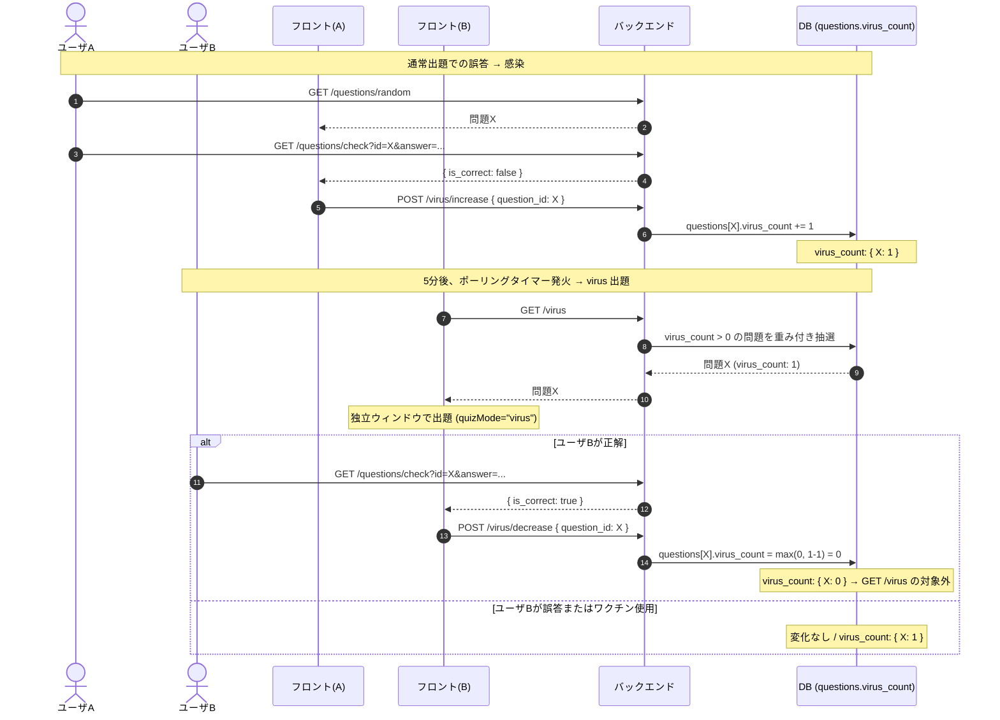

# 感染機能 仕様書

## 0. 用語の定義

| 用語 | 意味 |
|---|---|
| **通常出題** | タイマー経過またはコマンド入力をトリガーに表示される問題 |
| **virus 出題** | virus 機能（感染ポーリング）によって表示される問題 |
| **ワクチン** | virus 出題を1回スキップできるアイテム。1日3個付与 |

---

## 1. 機能の概要

ユーザが通常出題で誤答した問題は、`questions.virus_count` が加算される。常駐アプリはデフォルト **5分間隔** でバックエンドへ問い合わせ、`virus_count > 0` の問題があれば独立ウィンドウで出題する。

- 難しい問題ほど `virus_count` が高くなり、**重み付きランダム抽選** で選ばれやすくなる
- virus 出題で正解すると `virus_count` が -1 される
- 誰かが間違えた難問が他のユーザにも降りかかる「ウイルス感染」を表現する

---

## 2. 前提条件

- バックエンドと DB は Render 上にホスト。複数ユーザが同一 DB を共有する
- フロントエンドは macOS に常駐するクライアントとして動作する
- ユーザは 4桁PIN で認証（`/users` / `/users/login`）

---

## 3. データモデル

### 3.1 virus_count カラム

独立した virus テーブルは作らず、`Question` テーブルに `virus_count` カラムを追加している。

| カラム | 型 | デフォルト | 説明 |
|---|---|---|---|
| `virus_count` | INTEGER NOT NULL | 0 | 感染レベル。0のとき virus 出題対象外 |

> **後付けマイグレーション**: SQLite 環境では起動時に `PRAGMA table_info(questions)` を確認し、`virus_count` カラムが存在しない場合に `ALTER TABLE` で追加する（`main.py`）。

### 3.2 状態変化のロジック

`quiz.answerLogged` フラグ（JS側のセッション変数）で「同一出題セッションでの初回解答」を管理する。一度 `true` になると、そのセッション中に再度 increment/decrement は送信されない。

| 状況 | `virus_count` の変化 |
|---|---|
| 通常出題、初回回答、**誤答** | **+1** (`POST /virus/increase`) |
| 通常出題、初回回答、正解 | 変化なし |
| 通常出題、2回目以降の回答 | 変化なし（`answerLogged` が `true` のため送信しない） |
| virus 出題、初回回答、**正解** | **-1** (`POST /virus/decrease`、下限 0) |
| virus 出題、初回回答、誤答 | 変化なし |
| virus 出題、2回目以降の回答 | 変化なし |

---

## 4. エンドポイント

### 既存エンドポイント（変更なし）

| メソッド | パス | 概要 |
|---|---|---|
| GET | `/questions/random` | ランダム出題 |
| GET | `/questions/personalize` | ユーザ別パーソナライズ出題（user_id クエリパラメータ） |
| GET | `/questions/check` | 正誤判定 |
| POST | `/answer_logs` | 回答ログ記録（rating 計算にも使用） |

### 新規追加エンドポイント（virus 機能）

#### `GET /virus`

`virus_count > 0` の問題を **重み付きランダム抽選** で1問返す。

- `virus_count` の合計値を分母に、各問題の `virus_count` を重みとした確率で抽選する
- 対象問題がなければ `404` を返す
- レスポンス形式は `GET /questions/random` と同一（`QuestionResponse`）

```python
# 実装イメージ（backend/app/routers/virus.py）
target = random.randrange(total_count)
cumulative = 0
for question in questions:
    cumulative += question.virus_count
    if target < cumulative:
        return question
```

#### `POST /virus/increase`

```json
Request:  { "question_id": 42 }
Response: { "question_id": 42, "virus_count": 3 }
```

`question_id` の `virus_count` を +1 する。

#### `POST /virus/decrease`

```json
Request:  { "question_id": 42 }
Response: { "question_id": 42, "virus_count": 2 }
```

`question_id` の `virus_count` を -1 する（下限 0、行の削除はしない）。

---

## 5. フロントエンドの挙動

### 5.1 virus ポーリングタイマー

`controller.py` 内の `_tick_virus_timer` が `tickTimer_`（0.2秒間隔の NSTimer）ごとに呼ばれる。

1. スリープ中または設定サスペンド中の場合 → タイマーをリセットして何もしない
2. virus ウィンドウが既に開いている場合 → JS 状態を同期するだけ（二重起動しない）
3. `_virus_deadline` が未設定 → タイマーを初期化して待機
4. `_virus_deadline` を超過した場合 → `show_virus_window()` を呼んでウィンドウを開く

デフォルトのポーリング間隔は **5分** (`VIRUS_POLL_INTERVAL_MINUTES = 5`)。`.env.public` で上書き可能。

### 5.2 virus ウィンドウ

- 通常ウィンドウ（メインの `_window`）とは **独立した別ウィンドウ** として開く
- タイトル: `"Linux Virus Infection"`
- サイズ: `EXPANDED_SIZE`（520×680）、画面右上に配置
- JS 側は `state.quizMode === "virus"` を受け取り、`LinuxVirusQuiz.loadQuestion("virus")` を呼ぶ
- ウィンドウを閉じると `_restart_virus_timer()` で次のタイマーが再起動される

### 5.3 ワクチン機能

| 仕様 | 詳細 |
|---|---|
| 1日の付与数 | **3個**（毎朝 4:00 にリセット） |
| 保存場所 | `localStorage`（キー: `linuxVirus.vaccine`） |
| 使用方法 | virus ウィンドウ上のワクチンボタン（💉）を押す |
| 使用効果 | virus ウィンドウを閉じる。`virus_count` は変化しない |
| 回復ホットキー | `Ctrl+Option+F`（デバッグ用、残数を3個に戻す） |

### 5.4 ホットキー一覧

| ホットキー | 動作 |
|---|---|
| `Ctrl+Option+Space` | 通常展開ウィンドウのトグル |
| `Ctrl+Option+V` | virus ウィンドウを手動で開く（スリープ中は無効） |
| `Ctrl+Option+Q` | アプリ終了 |
| `Ctrl+Option+F` | ワクチン残数を3個に回復（デバッグ用） |

---

## 6. シーケンス図



---

## 7. セキュリティ上の懸念点

`POST /virus/increase` と `POST /virus/decrease` はフロントから任意に呼べる設計のため、悪意あるクライアントが `virus_count` を改ざんできる。

現状はハッカソンの内部利用かつ改竄インセンティブがないため **許容**。将来オンライン公開する場合は以下を検討:

- 出題時にサーバが一意な「出題トークン」を発行し、解答通知時に検証する方式
- virus 専用の判定エンドポイントを新設し、サーバ側で正誤判定と count 操作を一括で行う方式
