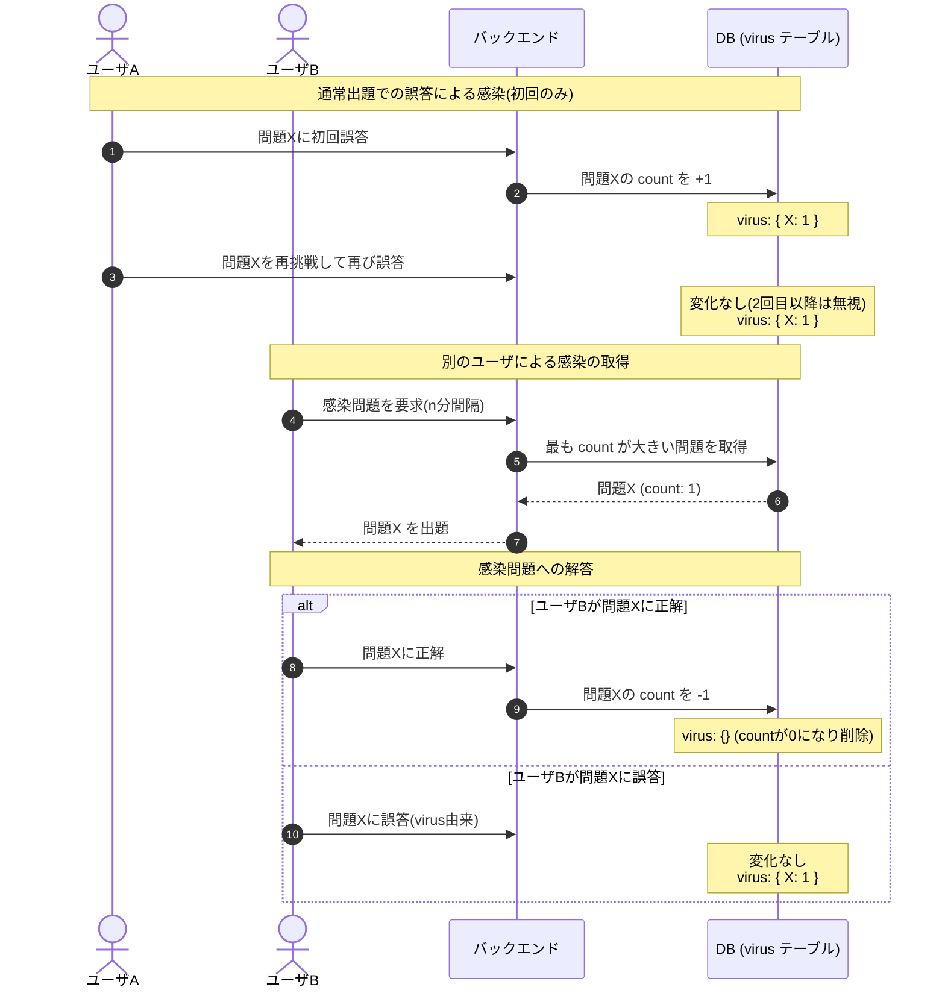

# 感染機能 設計叩き台

## 0. 用語の定義
- **通常出題**: ユーザのコマンド入力 or 時間経過によって出題される既存の問題
- **virus 出題**: virus 機能によって出題される問題

## 1. 機能の概要

ユーザが通常出題で誤答した問題は、**全ユーザ共通の virus テーブル**に蓄積される。常駐アプリは定期的にバックエンドへ問い合わせ、virus テーブルに問題が溜まっていれば、それを「感染」として出題する。

これにより、難しい問題ほど virus テーブルに残り続け、結果として「**誰かが間違えた難問が、他のユーザにも降りかかってくる**」というウイルスのような挙動を実現する。

---

## 2. 前提条件

- これまで単一ユーザ前提だったが、本機能の追加により**複数ユーザ前提**となる
- バックエンドと DB は Render 上にホストし、複数ユーザがアクセス可能とする
- フロントエンドはコマンドラインから起動するクライアントとして動作する

---

## 3. 感染ロジック

### 3.1 virus テーブルの構造

| カラム | 型 | 説明 |
|---|---|---|
| `question_id` | int | 問題の ID |
| `count` | int | 誤答数(感染レベル) |

問題 ID は重複しない(同じ問題は 1 行で、カウントが増減する形式)。

### 3.2 状態変化のロジック

| イベント | virus テーブルの変化 |
|---|---|
| 通常出題で**初回**誤答 | 該当問題の `count` を **+1**(行がなければ新規作成) |
| 通常出題で 2 回目以降の誤答 | 変化なし(同じユーザの繰り返し誤答は count に寄与しない) |
| 通常出題で正解 | 変化なし |
| virus 出題で誤答 | 変化なし(増えない) |
| virus 出題で**初回**正解 | 該当問題の `count` を **-1**(0 になったら行を削除) |
| virus 出題で 2 回目以降の正解 | 変化なし |

**初回判定の管理**: フロント側で問題ごとに「初回の解答フラグ」を保持し、初回の判定時のみバックエンドに通知する(既存の解答ログのロジックと同じ仕組み)。

### 3.3 感染トリガ

- 常駐アプリが**n 分間隔**でバックエンドに問い合わせる
- 取得対象は「virus テーブルで最も `count` が大きい問題」を 1 問
- 自分が誤答した問題も自分に返ってくる可能性がある
- 通常出題(時間経過 / コマンド検知)と**並行**して動作する
  - 通常出題のポップアップ表示中でも、virus が届けば**上に重なって表示**される

---

## 4. シーケンス図

---

## 5. 追加が必要なエンドポイント

既存のエンドポイント(`GET /questions/random`, `GET /questions/check`, `POST /answer_logs` 等)は本機能で変更しない。本機能では以下の追加を想定:

- **virus 出題用エンドポイント**: 「最も count が大きい問題を返す」もの(例: `GET /virus`)
- **virus 増減用エンドポイント**: 初回判定時にフロントから呼ばれ、count を増減させるもの(例: `POST /virus/increment` と `POST /virus/decrement` など)

### virus 通知エンドポイントの責務

`POST /virus` は、初回判定時かつ count に変化が必要な場合のみフロントから呼ばれる。

| 状況 | 操作 |
|---|---|
| 通常出題、初回、正解 | リクエストを送らない |
| 通常出題、初回、誤答 | `count` を **+1**(行がなければ作成) |
| virus 出題、初回、正解 | `count` を **-1**(0 になったら削除) |
| virus 出題、初回、誤答 | リクエストを送らない |

具体的なパス・リクエスト形式は実装担当が決定する。

### 懸念点

フロントが increment / decrement の指示を送る設計のため、クライアントが意図的に嘘をつけば virus テーブルを操作できてしまうセキュリティ的な脆弱性がある。

今回はハッカソンの内部利用かつ、改竄するインセンティブがないため、**この懸念点は許容**してもいいと思われる。

将来オンライン公開する場合や、メンバーがこの点を重視する場合は、別途以下のような対策を検討する:

- 出題時にサーバが一意な「出題ID」を発行し、解答通知時にそれを送る方式
- virus 専用の判定エンドポイントを新設し、判定と count 操作を一括で行う方式

---

## 6. 議論したい論点

### 論点1: ポーリング間隔の最終決定

現状「5 分間隔」で仮決定しているが、これで本当に良いか議論したい。

| 案 | 概要 | メリット | デメリット |
|---|---|---|---|
| A | 5分間隔(現状案) | ウイルスっぽい頻度 | 短すぎ?長すぎ? |
| B | 3〜7分のランダム間隔 | ウイルスっぽさが増す(予測不能) | 実装がやや複雑 |
| C | デモ用に短い間隔(30秒など) | デモで挙動が見せやすい | 普段使いではうざい |
